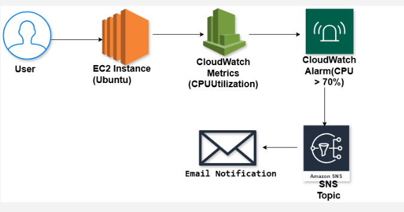
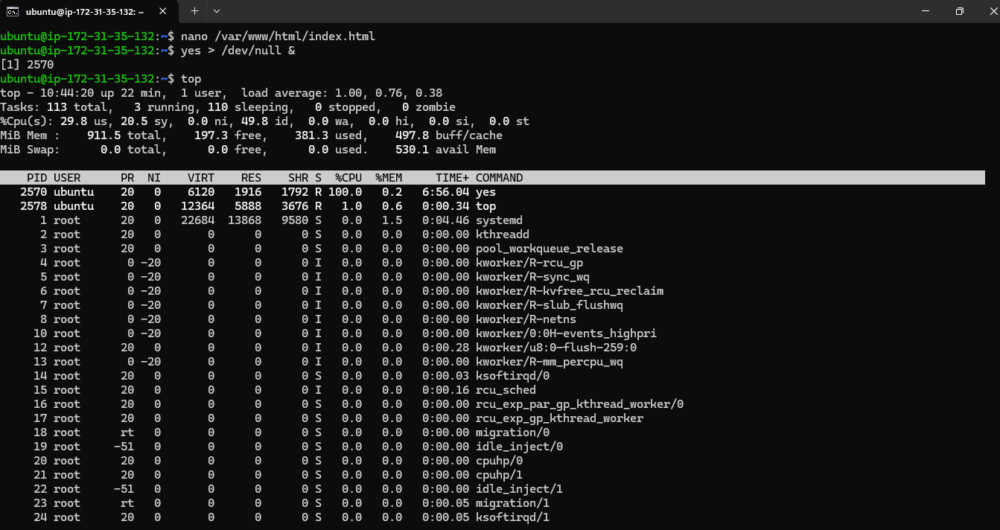
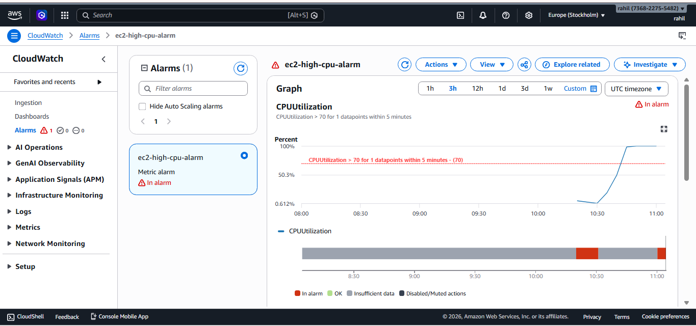
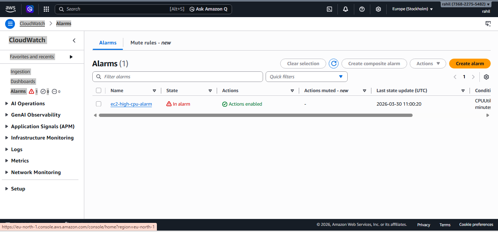
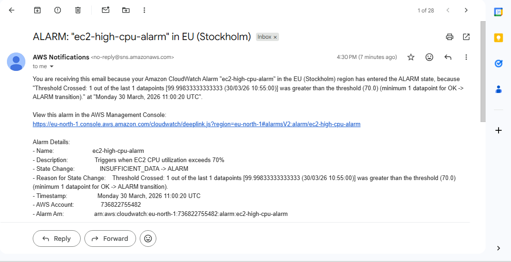

# AWS EC2 Monitoring and Alerting using CloudWatch and SNS

## Project Overview
This project demonstrates how to monitor an Amazon EC2 instance using Amazon CloudWatch and configure automated alerts using Amazon SNS. The monitoring system tracks CPU utilization and sends an email notification when the CPU usage exceeds a defined threshold.

## Services Used
- Amazon EC2
- Amazon CloudWatch
- CloudWatch Alarms
- Amazon SNS

## Architecture Diagram

## Project Workflow
1. Launch an EC2 instance running Ubuntu.
2. CloudWatch collects performance metrics from the EC2 instance.
3. A CloudWatch alarm is configured to monitor CPU utilization.
4. When CPU usage exceeds 70%, the alarm is triggered.
5. The alarm sends a notification to an SNS topic.
6. SNS sends an email notification to the subscribed user.

## Screenshots

### CPU Stress Test on EC2

### CloudWatch Metrics

### CloudWatch Alarm Triggered

### SNS Email Notification

